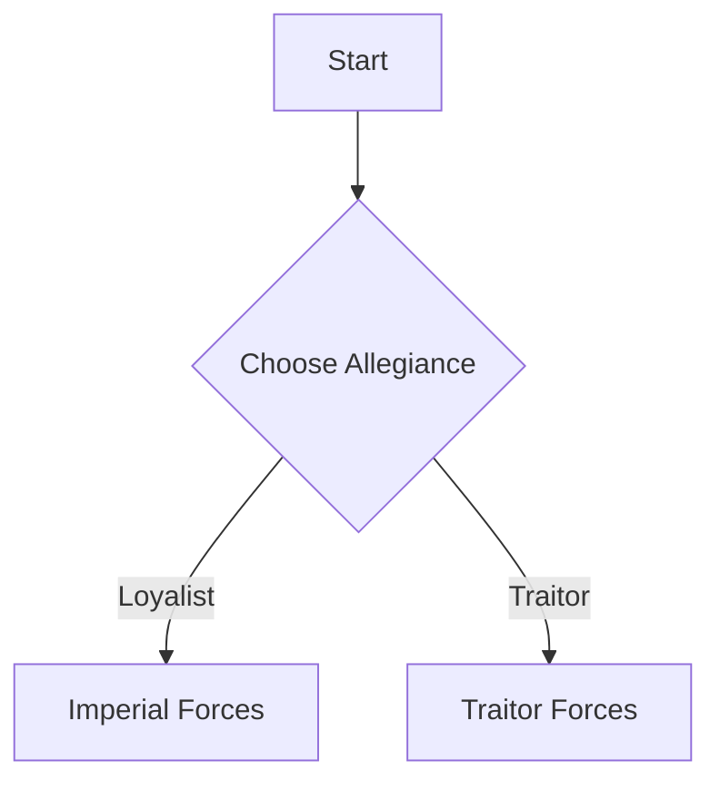

# Contributing to OpenCrusade

Thank you for your interest in contributing to **OpenCrusade**, a community-driven collection of homebrew rules for Horus Heresy tabletop campaigns. This book is built with `mdBook` and written entirely in Markdown.

## Getting Started

1. **Fork the repository** and create a new branch.
2. **Edit Markdown files** inside the `src/` directory following the established structure.
3. **Run `mdbook serve`** locally to preview your changes:  
   ```bash
   mdbook serve
   ```

4. **Submit a Pull Request** with a concise summary of your changes.

## Writing with Markdown

We use [Markdown](https://www.markdownguide.org) to write and structure the content. Markdown is a lightweight markup language that allows you to format text using plain syntax. Headers, lists, tables, links, and code blocks are all easily supported. This ensures that content remains readable and editable with minimal tooling.

If you're new to Markdown or need a refresher, the [Markdown Guide](https://www.markdownguide.org) is an excellent resource.

## Using Mermaid for Diagrams

To visualize relationships, flowcharts, and campaign structures, we support [Mermaid.js](https://mermaid.js.org/intro/) in Markdown files. Mermaid allows you to define diagrams using simple text-based syntax directly in your `.md` files.

Example:

````

````

Refer to the [Mermaid documentation](https://mermaid.js.org/intro/) for more syntax and usage examples.

## Creating and Sharing Mission Maps

We encourage contributors to design mission maps using [Dungeon Scrawl](https://app.dungeonscrawl.com), a free and user-friendly tool for creating tactical maps.

When adding a mission:

* Export and include a `.png` file for the rendered map (for use in the book).
* Include the original `.ds` source file so other contributors can easily modify and build upon it.

Both files should be placed in the appropriate `assets/` subfolder for the mission, and referenced from the mission’s Markdown page.

## Style Guidelines

* Use proper Markdown formatting.
* Use headers, lists, and tables consistently.
* Keep language concise, clear, and in-universe when applicable.
* Use British English spelling (e.g., *armour*, *honour*, *defence*).
* Stay true to the tone and lore of Warhammer: grim, archaic, militaristic.
* Follow the folder structure — don't add files to the root directory.
* One unit, faction, or rule per file. Break content into subpages if needed.

## Content Guidelines

* **Units and Characters:** Use the standard [Unit Template](./src/appendices/unit-template.md).
* **Rules:** Clearly explain how new mechanics work and how they interact with existing rules.
* **Legions/Factions:** Maintain consistency with established lore, unless writing alternate history or Blackshield content.
* **Weapon Stats:** Include a weapon profile table if introducing new wargear.

## Proposing Major Changes

For larger ideas (new mechanics, campaign systems, faction rewrites), please open [a discussion thread](https://github.com/shanduur/OpenCrusade/discussions) first to discuss with others. This avoids duplicate work and ensures cohesion.

## Licensing

By contributing, you agree that your content may be published under the repository’s license. You retain credit as the author of your submission.
