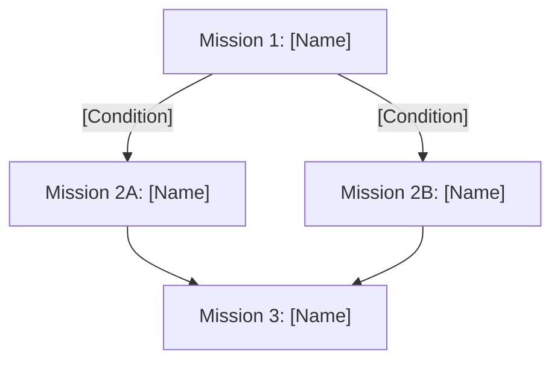

# [Campaign Title]

{{#authors shanduur}}

> Use this standardized format to create and share narrative campaigns for your Horus Heresy battles. Campaigns link missions through branching outcomes, persistent effects, and narrative progression.

**Recommended Force Size:** [X Points]  
**Format:** [Format]  
**Setting:** [Setting]  
**Timeframe:** [Timeframe]  
**Participating Factions:**  
- [Group 1] [Factions]
- [Group 2] [Factions]
- [Group 3] [Factions]
- [Group 4] [Factions]

## Campaign Flow

- [Mission 1: [Name]](./mission-template.md)
- [Mission 2A: [Name]](./mission-template.md)
- [Mission 2B: [Name]](./mission-template.md)
- [Mission 3: [Name]](./mission-template.md)

## Campaign Rules

### Persistence & Tracking

* Units may gain **battle scars**, **experience**, or **bonuses**
* Warlords may earn traits or suffer wounds carried into next missions
* Optional XP/Resource system for veteran campaigns

### Strategic Assets (Optional)

| Asset  | Effect    |
| ------ | --------- |
| [Name] | [Effects] |
| [Name] | [Effects] |
| [Name] | [Effects] |

## Epilogue

Write a short narrative resolution depending on the final outcome:

* **Loyalist Victory:** [Narrative consequence]
* **Traitor Victory:** [Narrative consequence]
* **Draw:** [Alternate or unresolved state]
